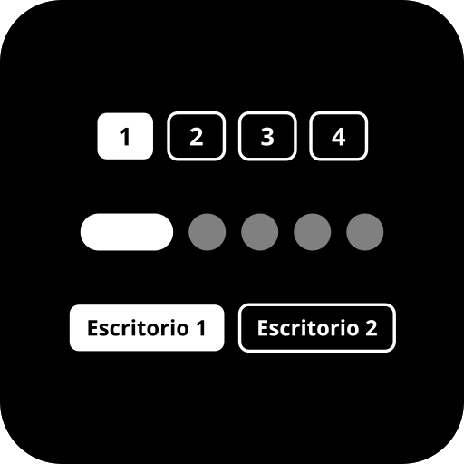

# Mike Desktop



A highly configurable and visually stunning virtual desktop pager exclusively designed for KDE Plasma 6. 

**Mike Desktop** offers a modern alternative to the default desktop pager, bringing fluid animations, deep customization, and three distinct visual modes to perfectly match your setup's aesthetic.

## ✨ Features

* **Three Unique Visual Styles:**
  * **Pills:** A minimalist approach featuring dots with a sliding, expanding "active pill" indicator.
  * **Numbers:** Fixed-size numbered boxes with fully customizable backgrounds, borders, and typography.
  * **Labels:** Dynamic boxes that display the actual names of your virtual desktops.
* **Deep Customization Engine:** Fine-tune almost every aspect of the widget:
  * Adjust colors for active and inactive states (supports alpha/transparency).
  * Control active/inactive opacity levels independently via sliders.
  * Modify gaps, margins, corner radius, and border thickness.
  * Change font sizes and toggle bold typography.
* **Live Desktop Renaming:** Rename your KDE virtual desktops directly from the widget's Kirigami settings panel. No need to open external system settings!
* **Fluid Animations:** Enjoy buttery-smooth sliding and fading transitions (built with OutCubic easing) when switching between desktops.
* **Native Plasma 6 Integration:** Built with modern QML and Kirigami, ensuring perfect geometry calculations, seamless panel integration (both compact and full representations), and asynchronous DBus calls to `org.kde.KWin` for zero-lag performance.

## 🚀 Requirements

* KDE Plasma >= 6.0
* KDE Frameworks >= 6.0

## 📦 Installation

### Option 1: KDE Store / Discover (Recommended)
You can install Mike Desktop directly from the KDE Store using the Plasma Discover app or the built-in "Get New Widgets" dialog on your desktop.

### Option 2: Manual Installation from Source
To install this widget manually from the repository, clone it and use the `kpackagetool6` utility:

```bash
# Clone the repository
git https://github.com/MikeDevQH/plasma6-widget-desktop.git
cd plasma6-widget-desktop

# Install the applet
kpackagetool6 -i .

# If you are updating an existing installation, run:
kpackagetool6 -u .
```
*(After installation, you may need to log out and log back in, or restart Plasma to see the widget in your list).*

## 🛠️ Usage
1. Right-click on your Plasma Panel or Desktop.
2. Select **"Add Widgets..."**
3. Search for **"Mike Desktop"** and drag it to your preferred location.
4. Right-click the widget and select **"Configure Mike Desktop..."** to customize its appearance.

## 🤝 Contributing
Contributions, issues, and feature requests are welcome! Feel free to check the [issues page](#) <!-- REPLACE_THIS_ISSUES_URL -->.

## 📄 License
This project is licensed under the [GPLv3 License](LICENSE).

---
*Developed by [MikeDevQH](https://github.com/MikeDevQH)*
